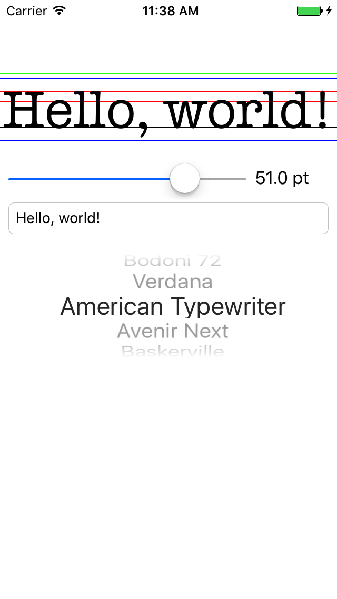

# typolines

Can show baseline, cap-line, ascender-line, descender-line (and some other lines) for a given font in a given size with a given text

## TODO

- Make text/font/color of font-lines configurable
- Add Multiline-support (is this even possible with Autolayout?)
- Icon?
- Use a StackView: Put the Label (and the lines) to the top, the configuration-stuff to the bottom?
- Put everything in a scrollview for landscape
- support different font-weights
- textField.resignFirstResponder
- systemfont
- convert this list into GH-issues
